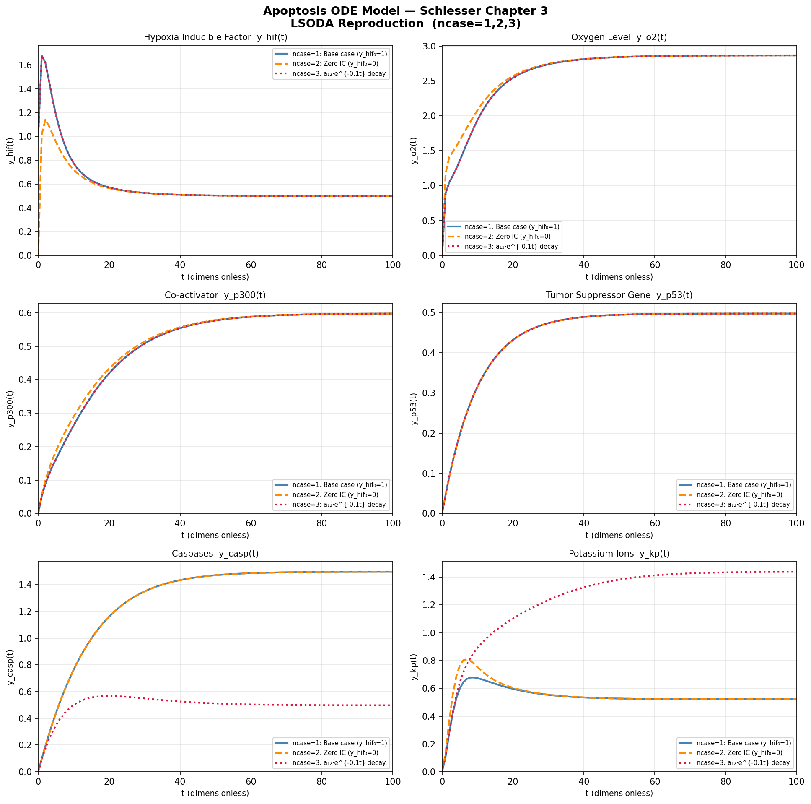
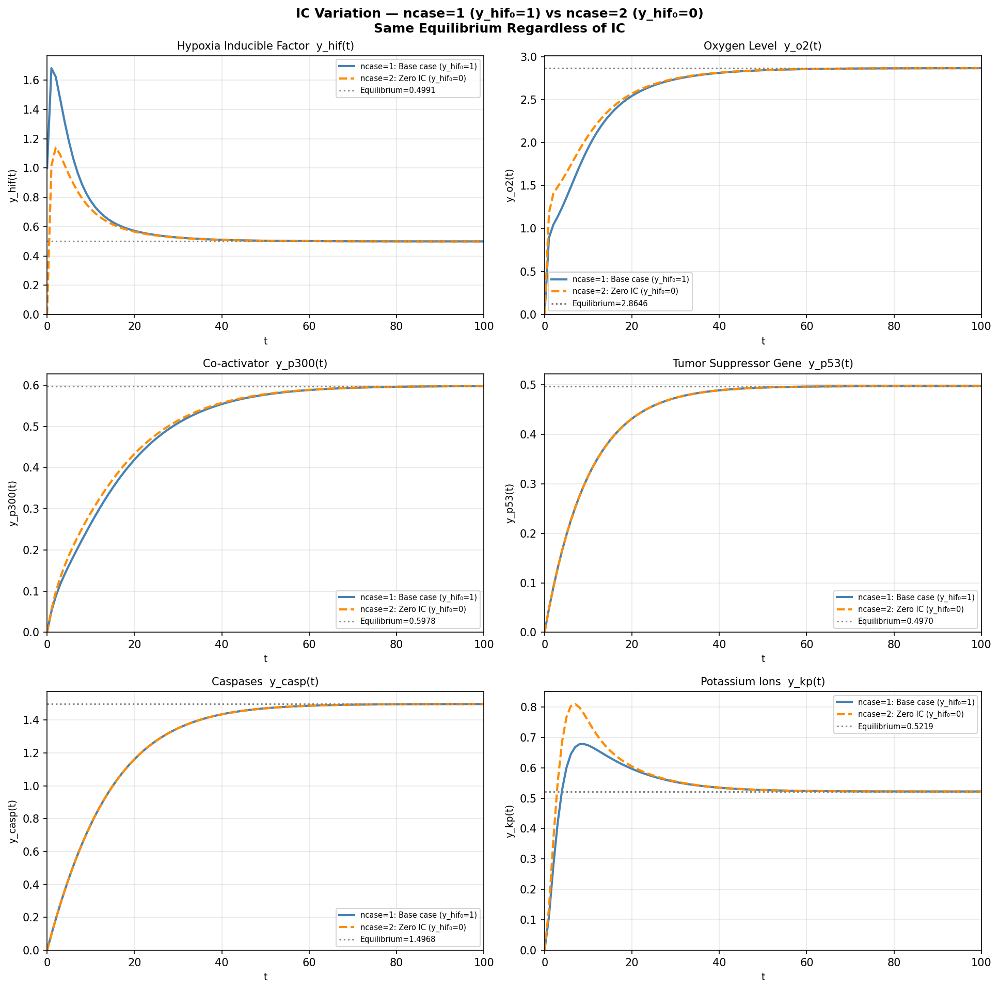
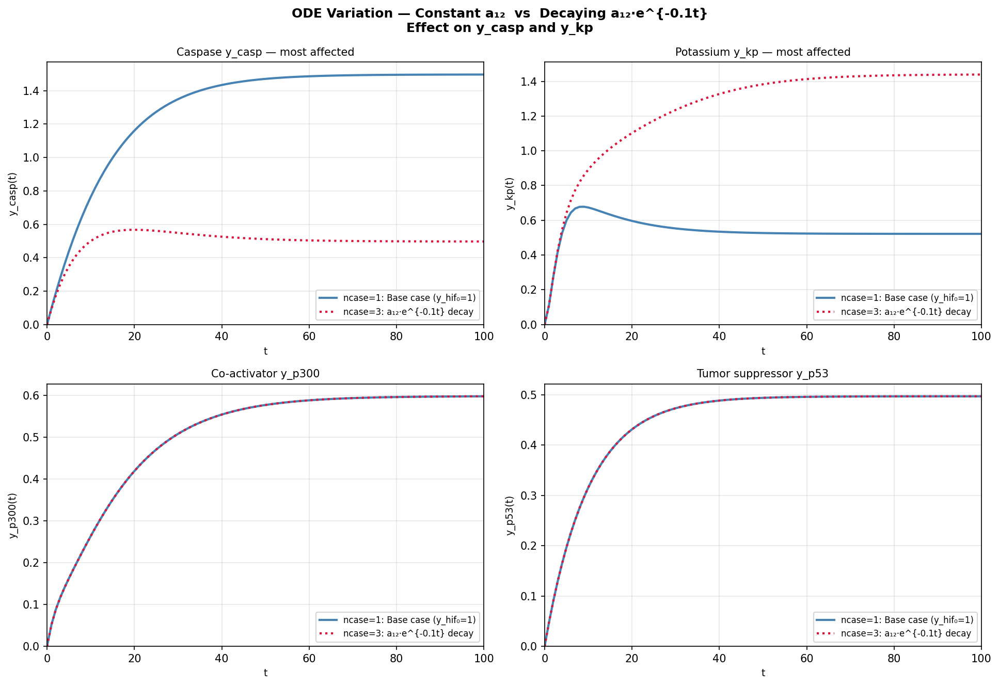
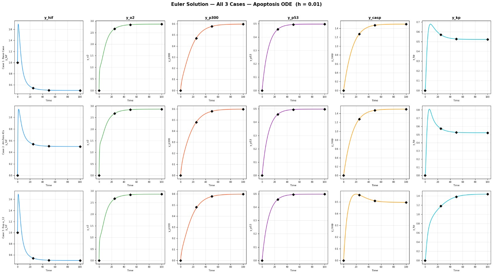
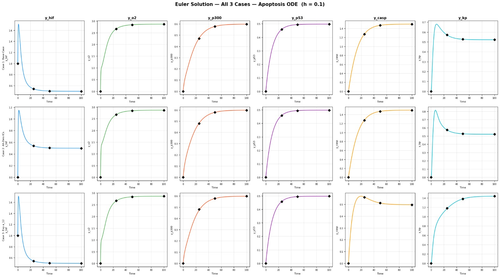
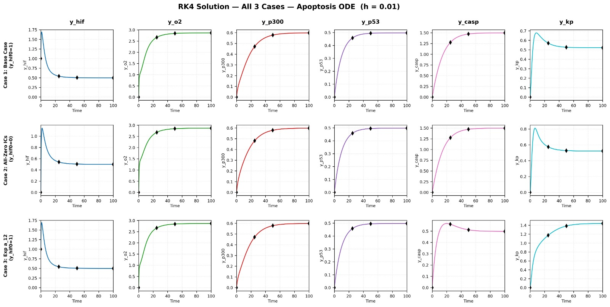
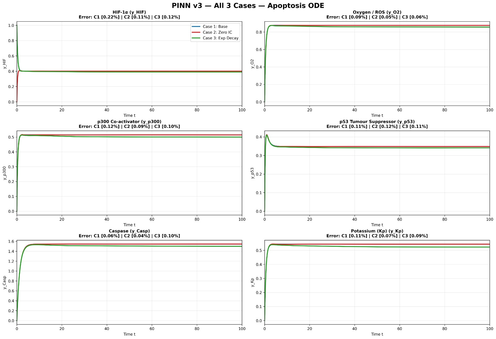
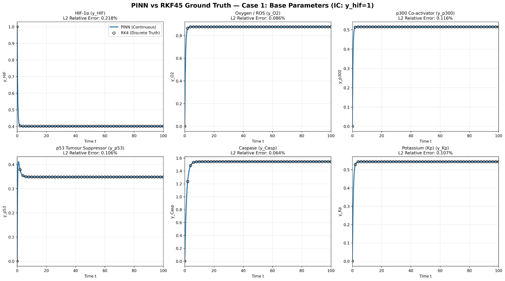
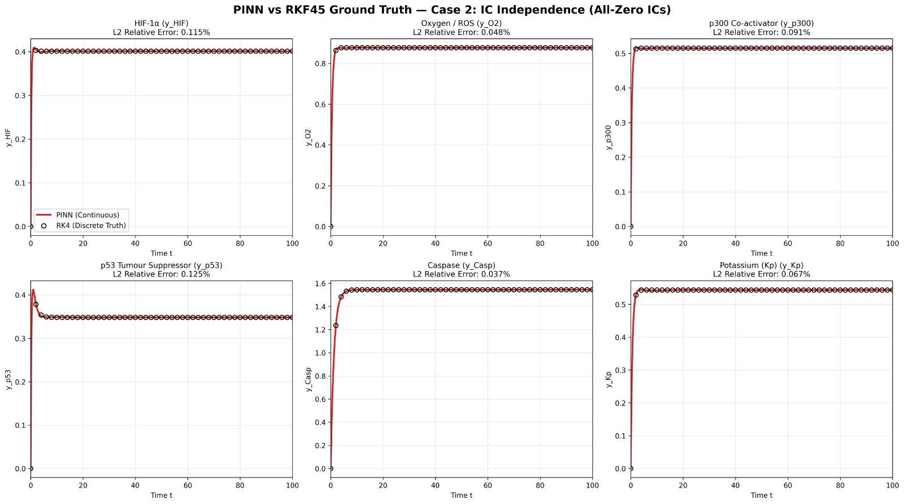
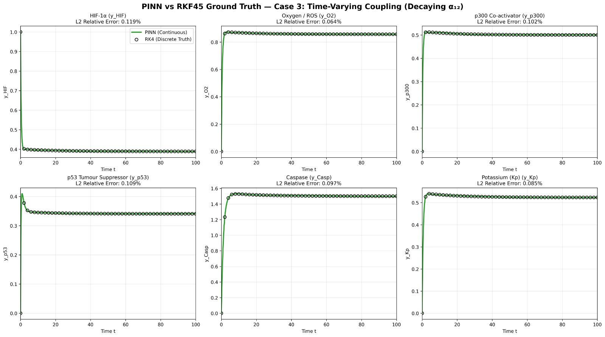

# Numerical Methods and Physics-Informed Neural Networks for an Apoptosis ODE Model


## Overview

This project investigates the numerical solution of a biomedical apoptosis model using both classical numerical methods and modern machine learning techniques.

The apoptosis system is represented as a coupled system of Ordinary Differential Equations (ODEs) describing the interaction between key biological variables involved in cell survival and programmed cell death.

Four different solution approaches are studied and compared:

- **LSODA** (Reference Solution)
- **Euler Method**
- **Runge-Kutta 4th Order (RK4)**
- **Physics-Informed Neural Network (PINN)**

The goal is to evaluate the accuracy, stability, and behavior of each method when solving the same biomedical ODE system under multiple experimental conditions.

---

## Biological Model

The model describes the dynamics of six interacting biological variables:

| Variable | Description |
|-----------|------------|
| HIF-1α | Hypoxia-Inducible Factor |
| O₂ / ROS | Oxygen / Reactive Oxygen Species |
| p300 | Transcription Co-Activator |
| p53 | Tumor Suppressor Protein |
| Caspase | Apoptosis Effector |
| K⁺ | Potassium Dynamics |

These variables are coupled through nonlinear differential equations representing cellular responses to hypoxia and apoptosis signaling pathways.

---

## Experimental Cases

Three different scenarios were investigated:

### Case 1 — Base Parameters

Reference apoptosis model using the original parameter set.

**Initial Condition**

```text
y_hif(0) = 1
```

---

### Case 2 — Initial Condition Independence

Tests system behavior when all state variables start from zero.

**Initial Conditions**

```text
All state variables = 0
```

---

### Case 3 — Time-Varying Coupling

Investigates the effect of a decaying coupling parameter α₁₂.

```text
α₁₂ = α₁₂(t)
```

This case examines how parameter variation influences apoptosis dynamics.

---

# Methods

## 1. LSODA (Reference Solver)

LSODA is an adaptive numerical ODE solver from the ODEPACK library.

Features:

- Automatic step-size control
- Automatic stiffness detection
- High numerical accuracy
- Used as the reference solution

Implementation:

```text
lsoda/lsoda_apoptosis.py
```

---

## 2. Euler Method

The Forward Euler method is the simplest explicit numerical integration scheme.

Formula:

yₙ₊₁ = yₙ + h f(tₙ,yₙ)

Characteristics:

- First-order accuracy
- Fast computation
- Simple implementation
- Sensitive to step size

Step sizes tested:

- h = 0.01
- h = 0.1

Implementation:

```text
euler/
```

---

## 3. Runge-Kutta 4th Order (RK4)

RK4 is a classical high-accuracy numerical integration method.

Characteristics:

- Fourth-order accuracy
- Stable for small step sizes
- Widely used in scientific computing

Implementation:

```text
rk4/
```

---

## 4. Physics-Informed Neural Network (PINN)

A Physics-Informed Neural Network (PINN) is used to solve the ODE system without traditional numerical time stepping.

Instead of learning from a dataset, the neural network learns a function that satisfies:

- The governing differential equations
- The initial conditions

### PINN Loss Function

Loss = ODE Residual Error + Initial Condition Error

The network:

Input:

```text
t
```

Output:

```text
[HIF, O₂, p300, p53, Caspase, K⁺]
```

Automatic differentiation is used to compute derivatives and enforce the governing physics during training.

Implementation:

```text
pinn/
```

---

# Repository Structure

```text
NumericalMethods_GlucoseToleranceTest/
│
├── euler/
│   ├── figures/
│   └── results/
│
├── rk4/
│   ├── figures/
│   └── results/
│
├── lsoda/
│   ├── figures/
│   ├── results/
│   └── lsoda_apoptosis.py
│
├── pinn/
│   ├── cases/
│   ├── figures/
│   ├── results/
│   ├── model.py
│   ├── physics.py
│   └── plot.py
│
└── README.md
```

---

# Results

## LSODA Reference Solutions

### Six-Variable Apoptosis Dynamics



---

### Initial Condition Comparison



---

### Time-Varying α₁₂ Analysis



---

## Euler Method

### h = 0.01



---

### h = 0.1



---

## Runge-Kutta 4th Order

### RK4 Solution



---

## Physics-Informed Neural Network

### PINN — All Cases



---

### Case 1 vs RKF45



---

### Case 2 vs RKF45



---

### Case 3 vs RKF45



---

# Key Findings

- LSODA provides a highly accurate reference solution for the apoptosis model.
- Euler successfully captures system behavior but is sensitive to step size.
- RK4 achieves significantly higher accuracy than Euler while remaining computationally efficient.
- PINNs accurately reproduce the dynamics of all six biological variables.
- Relative errors between PINN predictions and RKF45 reference solutions remain below 0.3% across all investigated cases.

---

# Requirements

Install dependencies:

```bash
pip install numpy scipy matplotlib pandas torch
```

---

# Running the Project

### LSODA

```bash
python lsoda_apoptosis.py
```

### PINN Training

```bash
python train_case1.py
python train_case2.py
python train_case3.py
```

### Generate Evaluation Plots

```bash
python plot.py
```

---

# References

William E. Schiesser

**Differential Equation Analysis in Biomedical Science and Engineering**

Chapter: Apoptosis ODE Model

---

# Authors

Numerical Methods Project

Faculty of Engineering

Biomedical Engineering / Scientific Computing
